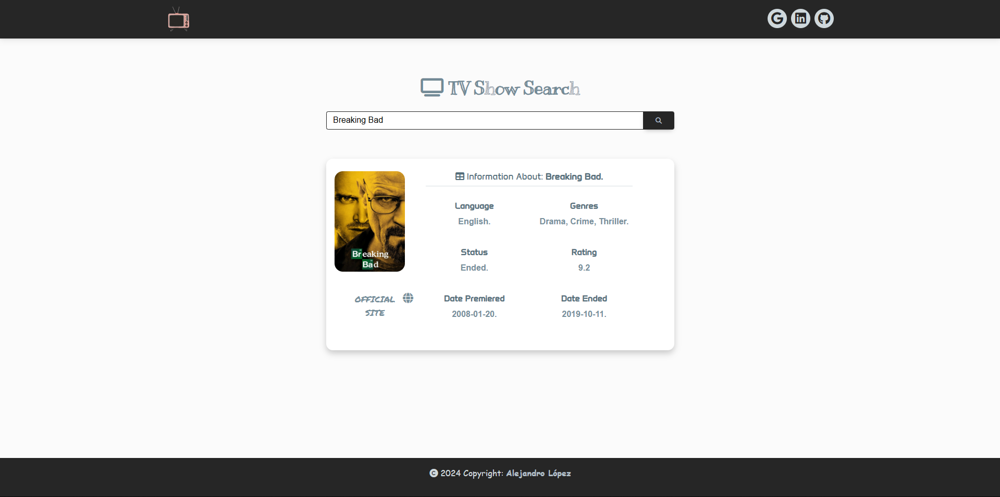

# <h1 align="center" style="color: #80cbc4;"> TV API 👨🏻‍💻 </h1> 
  

The following web application provides TV show data by returning main data for each of them, using the TV Maze API.

    

` TV Maze API ` We provide a free, fast and clean REST API that is easy to use, returns JSON, and conforms to HATEOAS and HAL principles. The root URL is https://api.tvmaze.com

   

  

## 
 Requirements 

- [HTML5](https://developer.mozilla.org/es/docs/Web/HTML) 
- [CSS3](https://developer.mozilla.org/es/docs/Web/CSS)
- [JavaScript](https://developer.mozilla.org/es/docs/Web/JavaScript)
- [BootStrap](https://mdbootstrap.com/)
- [Sweet Alert2](https://sweetalert2.github.io/)
- [TV MAZE API ](https://www.tvmaze.com/api)

  

## 
 Screenshot Project 💻 

🔶 [Project Website](https://alejandro-190107.github.io/TV-Show-API/)

